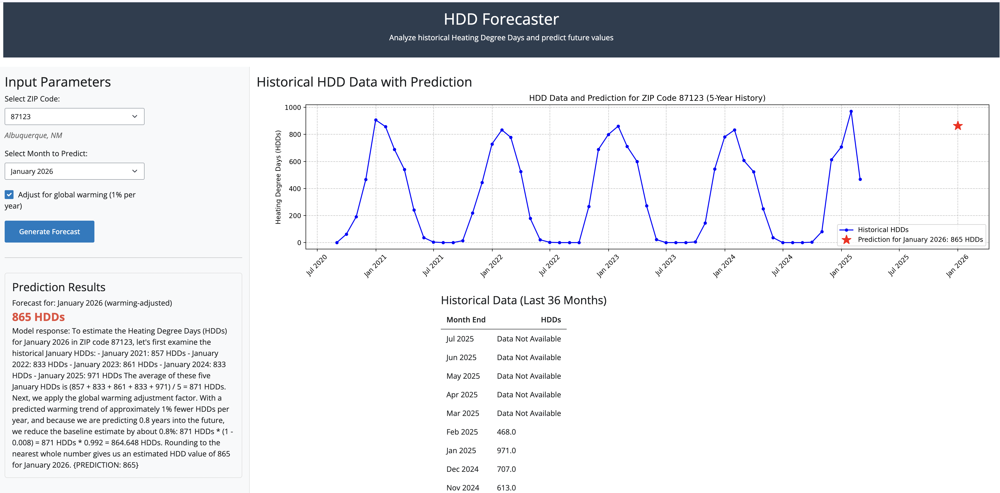

# 🔥 HDD Forecaster

**HDD Forecaster** is an interactive Python Shiny web application that visualizes historical **Heating Degree Days (HDDs)** by ZIP code and uses **OpenAI's GPT-4o** model to predict future HDD values.

It supports:
- Visualizing 5 years of historical HDD data.
- Predicting next-month HDDs using AI-enhanced reasoning and trends.
- Interacting through a clean and responsive UI built with Python + Shiny.

---

## 📸 Screenshot



---

## 🚀 Features

- 🔎 **ZIP Code Lookup**: Select from available ZIPs in your dataset.
- 📆 **Target Month Selection**: Choose a month to forecast HDDs.
- 🤖 **AI-Powered Estimation**: GPT-4o uses recent HDD history to generate a forecast and explain its reasoning.
- 📊 **Line Plot**: Visualizes historical HDDs with your forecast highlighted.
- 📋 **Table**: Tabular display of historical values (last 36 months).

---

## 📁 Project Structure

```bash
.
├── data/
│   └── HDD Raw Data.xlsx         # Input Excel file with HDDs by ZIP and date
├── app.py                        # Main application script
├── requirements.txt              # Dependencies
├── .env                          # Your OpenAI API key (not committed)
└── README.md
```

---

## 🧪 Requirements

Install dependencies with:

```bash
pip install -r requirements.txt
```

---

## 🔐 .env File

Create a `.env` file with your OpenAI API key:

```
OPENAI_API_KEY=your-key-here
```

---

## 🏃 Running the App

```bash
python app.py
```

Then open your browser and go to:  
**http://127.0.0.1:8000** or the Shiny-hosted local port.

---

## 📊 Input File Format

Your `HDD Raw Data.xlsx` file must contain a worksheet named **`background`** with at least these columns:

| Month End | Station Zip | HDDs |  
|-----------|-------------|------|  
| 1/31/20   | 3057        | 543  |

---

## ⚙️ How the Forecast Works

1. User selects a ZIP and target month.
2. The app provides GPT-4o with the most recent 5 years of HDD data for that ZIP.
3. GPT analyzes the pattern and returns a **numeric prediction** like `{PREDICTION: 123}`.
4. The result is extracted, displayed in text, and visualized on the chart.

---

## 📌 Notes

- The AI model does **not know the future** — it extrapolates based on patterns.
- Your predictions may vary depending on available data and date ranges.
- The app uses OpenAI **tool calling** to fetch data on demand.

---

## Publish

- Published to https://cmead.shinyapps.io/cmeadhackathon/
- rsconnect deploy shiny . --name cmead --title cmeadHackathon

---

## 📬 Contact

For questions or enhancements, feel free to reach out or open an issue.
